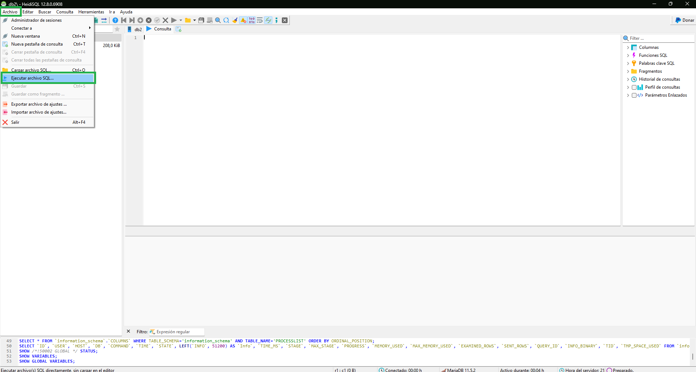
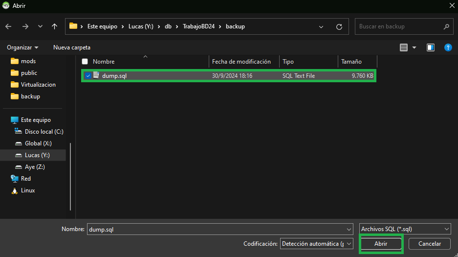
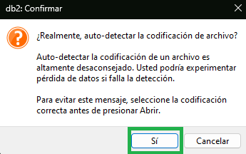

# Registro de Propiedad Automotor

### **1.** Introducción

La Base de Datos de https://datos.gob.ar/dataset/justicia-inscripciones-iniciales-autos está diseñada para almacenar y gestionar información sobre el registro de vehículos en el país. Esta base incluye detalles sobre los automotores, sus titulares, fechas de inscripción, y los registros seccionales donde fueron inscriptos.

### **2.** Diagrama de base de datos


### **3.** Instalacion

- Clonación del repositorio hacia una carpeta cualquiera.

```
git clone https://github.com/eman3560/TrabajoBD24.git
```

- Una vez clonado, importar dump sql (heidi).

> Ir a Archivo > Ejecutar Archivo SQL.



> Buscar el dumpfinal.sql y abrirlo.



> Una vez abierto confirmar la auto detección de codificación.



### **4.** Sentencias

### Creación y uso de la base de datos.
```mysql
CREATE DATABASE pat24;
USE pat24;
```

### Creación de la tabla principal de la base de datos.
- Se cargan todos los campos como varchar(255). Posteriormente se modificarán para reflejar el verdadero tipo de dato que contiene.
```mysql
CREATE TABLE base(
    base_cod                        	MEDIUMINT PRIMARY KEY AUTO_INCREMENT,
    tramite_tipo	                		VARCHAR(255),
    tramite_fecha	                		VARCHAR(255),
    fecha_inscripcion_inicial	    		VARCHAR(255),
    registro_seccional_codigo	    		VARCHAR(255),
    registro_seccional_descripcion		VARCHAR(255),
    registro_seccional_provincia			VARCHAR(255),
    automotor_origen	            		VARCHAR(255),
    automotor_anio_modelo	        		VARCHAR(255),
    automotor_tipo_codigo	        		VARCHAR(255),
    automotor_tipo_descripcion	    	VARCHAR(255),
    automotor_marca_codigo	        		VARCHAR(255),
    automotor_marca_descripcion	    	VARCHAR(255),
    automotor_modelo_codigo	        	VARCHAR(255),
    automotor_modelo_descripcion			VARCHAR(255),
    automotor_uso_codigo	        		VARCHAR(255),
    automotor_uso_descripcion	   		VARCHAR(255),
    titular_tipo_persona	        		VARCHAR(255),
    titular_domicilio_localidad	    	VARCHAR(255),
    titular_domicilio_provincia	    	VARCHAR(255),
    titular_genero	                	VARCHAR(255),
    titular_anio_nacimiento	        	VARCHAR(255),
    titular_pais_nacimiento	        	VARCHAR(255),
    titular_porcentaje_titularidad		VARCHAR(255),
    titular_domicilio_provincia_id		VARCHAR(255),
    titular_pais_nacimiento_id	    	VARCHAR(255) 
);
```

### Carga del .csv al entorno.
```mysql
LOAD DATA LOCAL INFILE 'C:\\BasePatentes\\TrabajoBD24\\dnrpa.csv' # Poner localización actual del csv
INTO TABLE base
FIELDS TERMINATED BY ',' 
ENCLOSED BY '"' 
LINES TERMINATED BY '\r\n' 
IGNORE 1 ROWS
(tramite_tipo, tramite_fecha, fecha_inscripcion_inicial, registro_seccional_codigo, registro_seccional_descripcion,
registro_seccional_provincia, automotor_origen, automotor_anio_modelo, automotor_tipo_codigo, automotor_tipo_descripcion,
automotor_marca_codigo, automotor_marca_descripcion, automotor_modelo_codigo, automotor_modelo_descripcion, automotor_uso_codigo,
automotor_uso_descripcion, titular_tipo_persona, titular_domicilio_localidad, titular_domicilio_provincia, titular_genero,
titular_anio_nacimiento, titular_pais_nacimiento, titular_porcentaje_titularidad, titular_domicilio_provincia_id,
titular_pais_nacimiento_id);
```

### Normalización de los datos.
- Existen campos con cadenas de texto vacias las cuales son convertidas a datos tipo NULL.
```mysql
UPDATE base 
SET 
    tramite_tipo = NULL
WHERE
    tramite_tipo = '';

###

UPDATE base 
SET 
    tramite_fecha = NULL
WHERE
    tramite_fecha = '';

###

UPDATE base 
SET 
    fecha_inscripcion_inicial = NULL
WHERE
    fecha_inscripcion_inicial = '';

###

UPDATE base 
SET 
    registro_seccional_codigo = NULL
WHERE
    registro_seccional_codigo = '';

###

UPDATE base 
SET 
    registro_seccional_descripcion = NULL
WHERE
    registro_seccional_descripcion = '';

###

UPDATE base 
SET 
    registro_seccional_provincia = NULL
WHERE
    registro_seccional_provincia = '';

###

UPDATE base 
SET 
    automotor_origen = NULL
WHERE
    automotor_origen = '';

###

UPDATE base 
SET 
    automotor_anio_modelo = NULL
WHERE
    automotor_anio_modelo = '';

###

UPDATE base 
SET 
    automotor_tipo_codigo = NULL
WHERE
    automotor_tipo_codigo = '';

###

UPDATE base 
SET 
    automotor_tipo_descripcion = NULL
WHERE
    automotor_tipo_descripcion = '';

###

UPDATE base 
SET 
    automotor_marca_codigo = NULL
WHERE
    automotor_marca_codigo = '';

###

UPDATE base 
SET 
    automotor_marca_descripcion = NULL
WHERE
    automotor_marca_descripcion = '';

###

UPDATE base 
SET 
    automotor_modelo_codigo = NULL
WHERE
    automotor_modelo_codigo = '';

###

UPDATE base 
SET 
    automotor_modelo_descripcion = NULL
WHERE
    automotor_modelo_descripcion = '';

###

UPDATE base 
SET 
    automotor_uso_codigo = NULL
WHERE
    automotor_uso_codigo = '';

###

UPDATE base 
SET 
    automotor_uso_descripcion = NULL
WHERE
    automotor_uso_descripcion = '';

###

UPDATE base 
SET 
    titular_tipo_persona = NULL
WHERE
    titular_tipo_persona = '';

###

UPDATE base 
SET 
    titular_domicilio_localidad = NULL
WHERE
    titular_domicilio_localidad = '';

###

UPDATE base 
SET 
    titular_domicilio_provincia = NULL
WHERE
    titular_domicilio_provincia = '';

###

UPDATE base 
SET 
    titular_genero = NULL
WHERE
    titular_genero = '';

###

UPDATE base 
SET 
    titular_anio_nacimiento = NULL
WHERE
    titular_anio_nacimiento = '';

###

UPDATE base 
SET 
    titular_pais_nacimiento = NULL
WHERE
    titular_pais_nacimiento = '';

###

UPDATE base 
SET 
    titular_porcentaje_titularidad = NULL
WHERE
    titular_porcentaje_titularidad = '';

###

UPDATE base 
SET 
    titular_domicilio_provincia_id = NULL
WHERE
    titular_domicilio_provincia_id = '';

###

UPDATE base 
SET 
    titular_pais_nacimiento_id = NULL
WHERE
    titular_pais_nacimiento_id = '';
```

### Creación de tablas importantes e inserción de las columnas de la tabla base a sus tablas.

- Tabla con las provincias.
```mysql
CREATE TABLE provincia(
prov_cod              TINYINT PRIMARY KEY AUTO_INCREMENT,
prov_nom              VARCHAR(50) NOT NULL
);

INSERT INTO provincia(prov_nom) 
SELECT DISTINCT registro_seccional_provincia
FROM base;
```
- Tabla tipo de automotor (automovil, camion, acoplado, etc). La base contiene una codificacion alfanumerica como identificador para cada tipo por lo que decidimos crear la tabla considerando dicho código y la descripcion de la misma.-
```mysql
CREATE TABLE automotor_tipo_descrip(
cod_tipo_desc        TINYINT PRIMARY KEY AUTO_INCREMENT,
tipo_cod             VARCHAR(2),
tipo_desc            VARCHAR(50) NOT NULL
);

INSERT INTO automotor_tipo_descrip(tipo_cod,tipo_desc)
SELECT distinct base.automotor_tipo_codigo, base.automotor_tipo_descripcion
FROM base;
```

- Tabla marca de automotor (Ford, Renault, Scania, etc). La base contiene una codificacion alfanumerica como identificador para cada marca por lo que decidimos crear la tabla considerando dicho código y la descripcion de la misma.-
```mysql
CREATE TABLE automotor_marca_descrip(
cod_marca_desc      SMALLINT PRIMARY KEY AUTO_INCREMENT,
marca_cod           VARCHAR(4),
marca_desc          VARCHAR(50) NOT NULL
);

INSERT INTO automotor_marca_descrip(marca_cod, marca_desc)
SELECT DISTINCT base.automotor_marca_codigo, base.automotor_marca_descripcion
FROM base;
```

- Tabla modelo de automotor (Mondeo, Ka, Etios, etc). La base contiene una codificacion alfanumerica como identificador para cada modelo por lo que decidimos crear la tabla considerando dicho código y la descripcion de la misma.-
```mysql
CREATE TABLE automotor_modelo_descrip(
cod_modelo_desc     SMALLINT PRIMARY KEY AUTO_INCREMENT,
modelo_cod          VARCHAR(4),
modelo_desc         VARCHAR(50) NOT NULL
);

INSERT into automotor_modelo_descrip(modelo_cod,modelo_desc)
SELECT DISTINCT base.automotor_modelo_codigo, base.automotor_modelo_descripcion
FROM base;
```

- Género del titular (Masculino, Femenino, No aplica)
```mysql
CREATE TABLE genero(
cod_titular_gen     TINYINT PRIMARY KEY AUTO_INCREMENT,
titular_gen         VARCHAR(50) NOT NULL
);

INSERT into genero(titular_gen)
SELECT DISTINCT base.titular_genero
FROM base;
```

> Generación de referencias en la tabla principal a las tablas relacionadas.
```mysql

# Remplazo a descripción de los géneros en la tabla base por la referencia a la tabla géneros.

UPDATE base
JOIN genero
ON base.titular_genero = genero.titular_gen
SET base.titular_genero = genero.cod_titular_gen;

# El campo titular_genero se importo como varchar(255) pero ahora que solo tiene un número como clave foranea no necesita ser tan grande. Lo convertimos a tipo tinyint porque
# ese tipo de dato es la clave primaria de la tabla y es necesario que sean iguales para hacer las reglas de integridad.

ALTER TABLE base MODIFY titular_genero TINYINT;

# Agrego reglas de integridad referencial.

ALTER TABLE base
ADD CONSTRAINT fk_genero
FOREIGN KEY (titular_genero)
REFERENCES genero(cod_titular_gen)
ON DELETE RESTRICT
ON UPDATE RESTRICT;
```

```mysql
UPDATE base
JOIN automotor_tipo_descrip
ON base.automotor_tipo_codigo = automotor_tipo_descrip.tipo_cod 
AND base.automotor_tipo_descripcion = automotor_tipo_descrip.tipo_desc
SET base.automotor_tipo_codigo = automotor_tipo_descrip.cod_tipo_desc;

ALTER TABLE base MODIFY base.automotor_tipo_codigo TINYINT;

ALTER TABLE base DROP COLUMN base.automotor_tipo_descripcion;

ALTER TABLE base
ADD CONSTRAINT fk_tipo
FOREIGN KEY (automotor_tipo_codigo)
REFERENCES automotor_tipo_descrip(cod_tipo_desc)
ON DELETE RESTRICT
ON UPDATE RESTRICT;
```

```mysql
UPDATE base
JOIN automotor_marca_descrip
ON base.automotor_marca_codigo = automotor_marca_descrip.marca_cod
AND base.automotor_marca_descripcion = automotor_marca_descrip.marca_desc
SET base.automotor_marca_codigo = automotor_marca_descrip.cod_marca_desc;

ALTER TABLE base MODIFY base.automotor_marca_codigo SMALLINT;

ALTER TABLE base DROP COLUMN base.automotor_marca_descripcion;

ALTER TABLE base
ADD CONSTRAINT fk_marca
FOREIGN KEY (automotor_marca_codigo)
REFERENCES automotor_marca_descrip(cod_marca_desc)
ON DELETE RESTRICT
ON UPDATE RESTRICT;
```

```mysql
UPDATE base
JOIN automotor_modelo_descrip
ON base.automotor_modelo_codigo = automotor_modelo_descrip.modelo_cod
AND base.automotor_modelo_descripcion = automotor_modelo_descrip.modelo_desc
SET base.automotor_modelo_codigo = automotor_modelo_descrip.cod_modelo_desc;

ALTER TABLE base MODIFY base.automotor_modelo_codigo SMALLINT;

ALTER TABLE base DROP COLUMN base.automotor_modelo_descripcion;

ALTER TABLE base
ADD CONSTRAINT fk_modelo
FOREIGN KEY (automotor_modelo_codigo)
REFERENCES automotor_modelo_descrip(cod_modelo_desc)
ON DELETE RESTRICT
ON UPDATE RESTRICT;
```

### Provincia del registro donde se inscribio el auto.
```mysql
UPDATE base
JOIN provincia
ON base.registro_seccional_provincia=provincia.prov_nom
SET base.registro_seccional_provincia=provincia.prov_cod;

ALTER TABLE base MODIFY base.registro_seccional_provincia TINYINT;

ALTER TABLE base
ADD CONSTRAINT fk_reg_secc_prov
FOREIGN KEY (registro_seccional_provincia)
REFERENCES provincia(prov_cod)
ON DELETE RESTRICT
ON UPDATE RESTRICT;
```

### Provincia del comprador del auto.
```mysql
UPDATE base
JOIN provincia
ON base.registro_seccional_provincia = provincia.prov_nom
SET base.registro_seccional_provincia = provincia.prov_cod;

# Error: hay 3 provincias escritas en forma diferente CIUDAD AUTONOMA DE BUENOS AIRES, SANTIAGO DEL ESTERO Y TIERRA DEL FUEGO
# se corrige remplazando en forma manual por los codigos a los que corresponden

# Correccion de error
UPDATE base
SET titular_domicilio_provincia = 11
WHERE titular_domicilio_provincia = 'C.AUTONOMA DE BS.AS';

UPDATE base
SET titular_domicilio_provincia = 15
WHERE titular_domicilio_provincia = 'T.DEL FUEGO';

UPDATE base
SET titular_domicilio_provincia = 21
WHERE titular_domicilio_provincia = 'SGO.DEL ESTERO';

# Cambio el nombre del domicilio de la provincia por su id correspondiente.

UPDATE base
JOIN provincia
ON base.titular_domicilio_provincia = provincia.prov_nom
SET base.titular_domicilio_provincia = provincia.prov_cod;

# Cambio el tipo de dato varchar(255) a tinyint
ALTER TABLE base MODIFY base.titular_domicilio_provincia TINYINT;

# Pasa a ser foreign key de provincia
ALTER TABLE base
ADD CONSTRAINT fk_prov_mod
FOREIGN KEY (titular_domicilio_provincia)
REFERENCES provincia(prov_cod)
ON DELETE RESTRICT
ON UPDATE RESTRICT;
```

### Editando el resto de los campos para dejarlos acordes al tipo de dato que almacenan.

```mysql
ALTER TABLE base MODIFY base.tramite_tipo VARCHAR(60);
ALTER TABLE base MODIFY tramite_fecha DATE;
ALTER TABLE base MODIFY base.fecha_inscripcion_inicial DATE;
ALTER TABLE base MODIFY registro_seccional_codigo VARCHAR(5);
ALTER TABLE base MODIFY registro_seccional_descripcion VARCHAR(50);
ALTER TABLE base MODIFY automotor_origen VARCHAR(12);
ALTER TABLE base MODIFY base.automotor_anio_modelo VARCHAR(5);
ALTER TABLE base MODIFY base.automotor_uso_codigo VARCHAR(1);
ALTER TABLE base MODIFY base.automotor_uso_descripcion VARCHAR(7);
ALTER TABLE base MODIFY base.titular_tipo_persona VARCHAR(9);
ALTER TABLE base MODIFY base.titular_domicilio_localidad VARCHAR(42);
ALTER TABLE base MODIFY base.titular_anio_nacimiento VARCHAR(5);
ALTER TABLE base MODIFY base.titular_pais_nacimiento VARCHAR(20);
ALTER TABLE base MODIFY base.titular_porcentaje_titularidad VARCHAR(3);
ALTER TABLE base MODIFY base.titular_domicilio_provincia_id VARCHAR(2);
ALTER TABLE base MODIFY base.titular_pais_nacimiento_id VARCHAR(4);
```
### Vistas y Consultas

> Vista de las principales 10 localidades en las que se patentaron autos.
```mysql
CREATE VIEW InscripcionSF10 AS
SELECT base.titular_domicilio_localidad, COUNT(base.titular_domicilio_localidad) AS Totales, provincia.prov_nom
FROM base, provincia
WHERE base.titular_domicilio_provincia = provincia.prov_cod AND provincia.prov_nom = "SANTA FE"
GROUP BY base.titular_domicilio_localidad, provincia.prov_nom
ORDER BY Totales DESC LIMIT 10;
```

> Vista de cuantas inscripciones fueron realizadas a masculinos, femeninos y otros.

```mysql
CREATE VIEW generos AS 
SELECT genero.titular_gen, COUNT(*) AS Totales FROM genero, base
WHERE base.titular_genero = genero.cod_titular_gen
GROUP BY genero.titular_gen
ORDER BY Totales DESC;
```

> Vista de las marcas que registraron mayor cantidad de patentamientos.

```mysql
CREATE VIEW TotalMarcas AS
SELECT automotor_marca_descrip.marca_desc, COUNT(*) AS Totales FROM automotor_marca_descrip, base
WHERE base.automotor_marca_codigo = automotor_marca_descrip.cod_marca_desc
GROUP BY automotor_marca_descrip.marca_desc
ORDER BY Totales DESC;
```

> Vista de marca y modelo más patentados durante Julio.

```mysql
CREATE VIEW MarcaModelo AS
SELECT automotor_modelo_descrip.modelo_desc, automotor_marca_descrip.marca_desc, COUNT(*) AS Totales
FROM base, automotor_modelo_descrip, automotor_marca_descrip
WHERE base.automotor_marca_codigo = automotor_marca_descrip.cod_marca_desc AND base.automotor_modelo_codigo = automotor_modelo_descrip.cod_modelo_desc
GROUP BY automotor_modelo_descrip.modelo_desc, automotor_marca_descrip.marca_desc
ORDER BY Totales DESC;
```

> Vista modelos de vehiculos y edad promedio de adquisición.

```mysql
CREATE VIEW ModelosEdad as
SELECT automotor_modelo_descrip.modelo_desc, automotor_marca_descrip.marca_desc, COUNT(*) AS Totales, YEAR(CURDATE())-round(avg(base.titular_anio_nacimiento)) AS Edad
FROM base, automotor_modelo_descrip, automotor_marca_descrip
WHERE base.automotor_marca_codigo = automotor_marca_descrip.cod_marca_desc 
AND base.automotor_modelo_codigo = automotor_modelo_descrip.cod_modelo_desc
AND base.titular_tipo_persona != "Jurídica"
GROUP BY automotor_modelo_descrip.modelo_desc, automotor_marca_descrip.marca_desc
ORDER BY Totales desc;
```

> Distribución de edades por inscripción.

```mysql
CREATE VIEW InscripcionEdad AS 
SELECT base.titular_anio_nacimiento, COUNT(*) AS Totales, YEAR(CURDATE())-round(avg(base.titular_anio_nacimiento)) AS Edad
FROM base
WHERE base.titular_tipo_persona != "Jurídica" AND base.automotor_uso_descripcion = "Privado" AND base.titular_anio_nacimiento < "2011"
GROUP BY base.titular_anio_nacimiento ASC;
```
